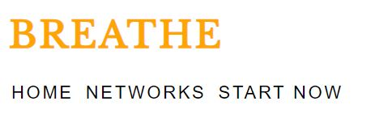
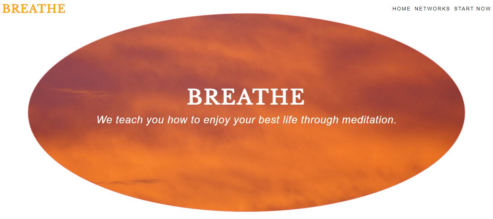
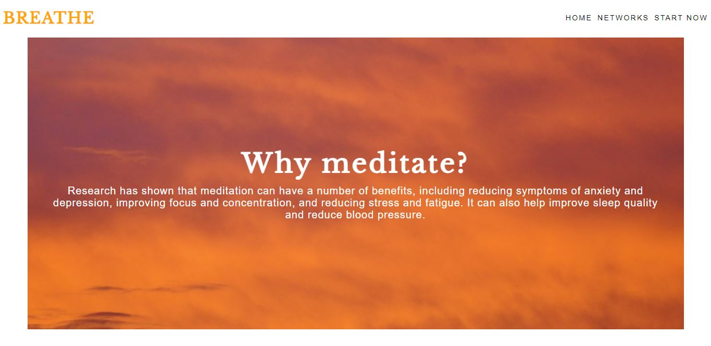
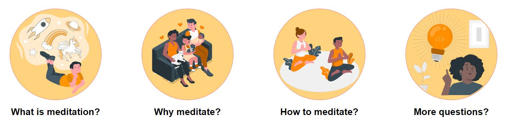
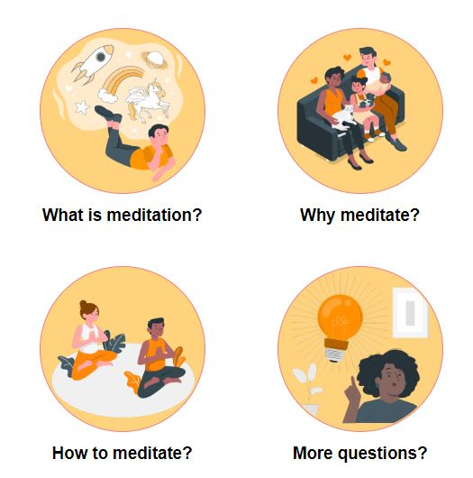
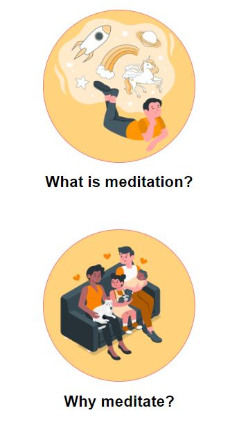

# BREATHE

[View the live project here.](https://klaramartinsson.github.io/BREATHE/)

Breathe is a website that want to teach the basics about meditation. The site is targeting beginners who are unsecure with mediation and want to make them feel more comfortable with it. Breathe also offer guided meditation over the phone to make it easier to start with meditation.

## Contents

## Features
### Navigation bar
The navigation bar is working fully responsvely and is featured on all webpages, making it easy for the users to to navigate with.
* I chosed a simple design so that the navbar would be easy to see.
* When the user hover over on the nav bar, a line appears underneath to make it easier to see which of them they are clicking on.
* On larger screen the nav bar is always located on the right corner.
* On smaller screens the nav bar goes under the logo. 
* If the user click on the logo in the left corner they arrive to the homepage to make it even easier to navigate.
* When the user clicks on the social network text they come to the bottom of the page for the links.
* When the user clicks on the start now text they come to a form to get a guided meditation.

### The main image
The first thing the eyes lands on are the main image that I use through all of the pages.
* The image represent a beautiful calming sky with information text in it.
* I put animation on it so the image zooms out when the home page opens up. It almost looks like the image it self is taking a breathe.
* On the other pages the main image is a rectangule instead of a circle to make it easier responsive with all of the text in it.

### Navigation for webpages about meditation
* I made another navigation bar for the diffrent webpages about meditation in circles to make it more appearing.
* The circles keeps the theme in the design from the home pages main image.
* They all have cute simple illustrations pictures.
* They are all in orange to keep the same color theme.
* When hover over they get a orange border around them, for the user to understand which one they are about to click on.
* The circles are featured on all pages to make it easy to navigate.
* On larger screens the circles will appear in line with each other.
* On medium screens the circles will appear in columns two by two.
* On smaller screens the circles will appear in vertically one by one.

### The what is mediation, why meditate and how to meditate pages
The purpose for the viewers with these pages is to get a better understanding about meditation. To get inspired to start living a healtier life style and more knowledge about how they could start with meditation.
* The pages look almost exactly like the same layout as the homepage. The only diffrent is that the main image is a rectangle instead of a circle, to fit in more text. 
* It is easy to read about the information in the image becuase of the contrasts colors with orange and white.

IMAGE

### The questions page
This section involves the most frequently asked questions about meditation. Its purpose is so that the users dont feel wierd or diffrent when starting with meditation. The page layout looks like the other webpages about meditation.

IMAGE

### The start now page
The start now page is build for the viewers to easier be able to start their journey with guided meditation.
* Involves a form where you can send a intreset for a guided meditation over the phone.
* There is a embedded youtube clip with a meditation guide that the user can control by themself.
* Other then that the webpages layout looks the same as the others.

IMAGE

### The footer
* The footer is very simple and contains the websites social network links.
* The social network links are all in orange to keep the color theme.
* When clicked on any of them they open up in another tab so they user stays on the website.

## Existing features
* Nice layout that look similar on all of the pages
* Responsive design from 497px and up
* All basic information a beginner would need for meditation
* A form for the user to sign up an interest for a guided meditation
* Easy navigation through all pages
* All external links opens up in a new tab
* All links have an aria-label for improving accessibility
* Youtube video with guided infomration
* Frequently asked questions and answers 

## Features that could improve
* Better responsive design for smaller screens with no scroll bars 
* Group meditation lessions
* More guided meditation movies
* Real social media sites for Breathe

## Testing
* The website have been tested with W3C Validator, Jigsaw Validator, The Am I Responsive website and Google Chrome lighthouse. 
* All pages have been testet for screen sizes from 479px and up. 
* The sites pictures are not pixeled or stretch out on any pages. 
* I confirm that all of the links, in every page works and that external links open ups in another tab.
* I tested that the form works: requires text in every field, will only accept email in the email field and the submit button works. 

### Code validation
#### HTML
* No errors where found in the code with the W3C Validator.
#### CSS
* The code made it through Jigsaws validatore with no problems.

### Am I Responsive
I looked at this website when I was making media queries to make sure the webpage looked good on all screens.

### Accessibility
I used Google Chromes lighthouse to be sure of the accessiblity. All of the pages have a good accessibility score. I also been doing this to make it better:
* Using an aria-labels on all the links 
* Using labels on my form.L abels ensure that form controls are announced properly by assistive technologies, like screen readers. (Text from Lighthouse)
* I have a title on my ifram for the youtube video. The title makes is easier for screen readers to describe the content of the frames.
* Using semantic HTML.
* Have a good contrast on my colors
* No disturbing background images or fonts that makes it harder to read.
* Ensuring that the menu and about meditation nav bar i easy to find on every page.

IMAGE

## Unfixed bugs
The responsivnes could be better for smaller screens like phones. The form is not centered, and my code skills wasn't enough to solve it. The how and question page also act diffrent at small screens with scroll bars to fit everything in. I dont see it as a huge problem but would be better if everything would be in place. After spending many hours trying to figure out the problem with google and youtube searches I had to accept that I just have to learn more about positioning and sizing for the next project. 

# Fixed bugs
* The forms yellow block was not filling up all of the text content when screen size were down to phone size. I fixed that by media queries and made more pixels to the height.

IMAGES

* The menu nav bar went into the logo at smaller screen size so I made another media querie and made it float left and used some margin to keep som space between other elements.

## Deployment
The site was deployed to GitHub pages. The steps to deploy are:
* Sign into GitHub
* Find the GitHub repository named "BREATHE", navigate to settings.
* In the left-hand side navigation bar click pages 
* Then in the source section you choose Main and select Root from the folder selection dropdown menu.
* Click on save and you then get the URL.
* All codes, files and images have been added in Github by using Git commands: git add ., git commit and git push. 

## Credits

### Content
* The content on the website is written mostly from the Ai chat ["Shako"](https://shako.ai/) or by Klara Martinsson.
* The icons in the bottom were from [Font Awesome](https://fontawesome.com/)
* I used inspiration from the [Love Running project](https://github.com/KlaraMartinsson/love-running/blob/main/assets/css/style.css) from codeinstitue program when doing the footer and menu nav bar.
* I got help with my code by looking at Izabella Lopez project. ["Checkup-dublin"](https://izabellalopes.github.io/checkup-dublin/index.html) I needed to get my navigation bar with the circles responsive at smaller screens. I wanted them to become columns but it didnt work for me with just "colums: 2;" so I saw her code with her similar circles in testimonals that worked for her. The code I used from her was "grid-template-columns: 1fr 1fr"
### Media
* The hero image that is the big picture that follows with on all the pages is taken from [Pexels](https://www.pexels.com/sv-se/).
* The illustrations are from [Storyset](https://storyset.com/).
* The guided meditation video is taken from [Youtube](https://www.youtube.com/watch?v=cyMxWXlX9sU&t=1s).

## Acknowledgements
I would like to say thank you to these that helped me with this project.
* My slack collegues, for clearing up on questions of about the course.
* My family and friends for checking out the webpage on their screens and giving critic.

